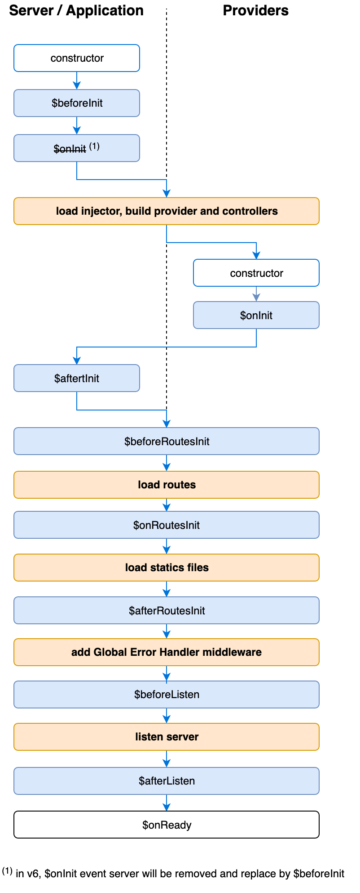

# Services

The decorator `@Service()` declare a new service can be injected in other service or controller on there `constructor()`.
All services annotated with `@Service()` are constructed one time.

## Configuration

You must adding the `services` folder on `componentsScan` attribute in your server settings as follow :
 
```typescript
import {ServerLoader, ServerSettings} from "@tsed/common";

@ServerSettings({
   rootDir: __dirname,
   mount: {
      '/rest': `./controllers/**/**.js`
   },
   componentsScan: [
       `./services/**/**.js`
   ],
   customServiceOptions: {}
})
export class Server extends ServerLoader {
   
}       
```

## Decorators

<ApiList query="module === '@tsed/di' && symbolType === 'decorator'" />

## Declaring a service

Create a new file in your services folder. Create a new Class definition and add the `@Service()` annotation on your class.

```typescript
import {Configuration, Injectable} from "@tsed/di";
import {OnInit, BeforeRoutesInit, OnRoutesInit, AfterRoutesInit, OnServerReady} from "@tsed/common"

@Injectable()
export class MyService implements OnInit, BeforeRoutesInit, OnRoutesInit, AfterRoutesInit, OnReady {
    private settings = {};
    
    constructor(@Configuration() private configuration: Configuration) {
        this.settings = this.configuration.get<any>('customServiceOptions');
    }
    
    public getSettings() {
        return this.settings;
    }
}
```

Finally, inject the service to another service:
```typescript
import {Injectable} from "@tsed/di";
import {MyService} from "./MyService";

@Injectable()
export class FooService {
    constructor(private myService: MyService) {
    
    }
}
```
Or to another controller: 

```typescript
import {Controller} from "@tsed/di";

import {MyService} from "./MyService";

@Controller('/rest') 
class MyController {
    constructor(private myService: MyService){
    
    }
}  
```

## Override a Service

The decorator [@OverrideService](/api/di/decorators/OverrideService.md) gives you the ability to
override some internal Ts.ED service like the [ParseService](/api/common/filters/services/ParseService.md).

Example usage:
```typescript
import {OverrideProvider} from "@tsed/di";
import {ParseService} from "@tsed/common";

@OverrideProvider(ParseService)
class CustomParseService extends ParseService {
    
}
```

## Lifecycle Hooks

Ts.ED 2.x introduce a new Lifecycle Hooks on the service that follows the [Hooks](/docs/hooks.md).
This lifecycle hooks that provide visibility into these key life moments and the ability to act when they occur.


A service that uses one of the phases of the lifecycle can add a number of things and can be completely autonomous.
This is the case with the example of the socket server (See the section [How to integrate Socket.io](/tutorials/socket-io.md)).

This schemes resume the order hooks called by Ts.ED:



Each interface has a single hook method whose name is the interface name prefixed with `$`. For example, the `OnInit`
interface has a hook method named `$onInit()` (old name `$onInjectorReady`) or that Ts.ED calls when all services are built.

```typescript
import {Hooks} from "@tsed/common";
import {Injectable, OnInit, Configuration} from "@tsed/di";

@Injectable()
export class MyService implements Hooks, OnInit {
  private settings = {};

  constructor(@Configuration() private configuration: Configuration) {
    this.settings = this.configuration.get<any>('customServiceOptions');
  }

  $onInit(): Promise<any> | void {
  }

  $beforeRoutesInit(): Promise<any> | void {
  }

  $afterRoutesInit(): Promise<any> | void {
  }

  $onReady(): Promise<any> | void {
  }
}
```

Since <Badge text="v4.31.0+" />, it also possible to handle `$onDestroy` hook when a service or a controller is
annotated with `@Scope('request')`:

```typescript
import {Injectable, Scope, OnDestroy} from "@tsed/di";

@Injectable()
@Scope('request')
export class MyService implements OnDestroy {
  $onDestroy() {
    console.log('Service destroyed');
  }
}
```

Hook | Purpose and Timing
---|---
$onInit | Respond after Injector have initialized all Services in the registry.
$beforeRoutesInit | Respond before loading the controllers. The middlewares and filters are already built.
$afterRoutesInit | Respond after the controllers build.
$onReady | Respond when the server is ready. At this step, HttpServer or/and HttpsServer object is available. The server listen the port.
$onDestroy | Respond when a Service or Controller is destroyed (uniquely when class is annoted with `@Scope('request')`.

::: tip Interfaces are optional

The interfaces are optional for JavaScript and Typescript developers from a purely technical perspective.
The JavaScript language doesn't have interfaces. Ts.ED can't see TypeScript interfaces at runtime because they disappear from the transpiled JavaScript.

Nonetheless, it's good practice to add interfaces to TypeScript directive classes in order to benefit from strong typing and editor tooling.
:::
